# SMART Odoo 20 — Functional modules audit & Wave 0 remediation

_Generated 2026-10-06 by Claude Code on branch `claude/odoo20-functional-migration`, then continued on `cursor/odoo20-wave-followup-9933` (Wave 0 + MASAR UI port + remaining Wave 4–6 API ports)._

## 1. Executive summary

| Metric | Count |
|---|---|
| MASAR functional modules (custom_addons) | 116 |
| Already in SMART (`masar_addons/`) | 106 |
| Missing from SMART | 10 |
| Compatible on SMART HEAD (installs on 20.0 and no Odoo-20 breaking API hit) | 62 |
| Partially ported (installs, but uses removed Odoo 20 APIs → runtime failures) | 18 |
| Broken on SMART HEAD (fresh install fails on Odoo 20.0, incl. 1 `installable=False`) | 26 |
| Install OK on SMART HEAD → after this branch | 80 → 86 (of 106) |
| Official OCA **20.0** version available today | 0 |
| Requires custom port (PORT MASAR TO 20) | 23 |
| Obsolete / replaced (REPLACE WITH NATIVE + DO NOT MIGRATE + DEPRECATE) | 5 |
| Keep SMART copy (ported/fixed here or already OK) | 82 |
| BLOCKED_BY_CURSOR (theme/website/UI lane) | 6 |

**OCA 20.0 status (checked 2026-10-06 by cloning every relevant OCA repo at `20.0`):** the branches exist for helpdesk, queue, server-ux, account-financial-tools/-reporting, account-closing, reporting-engine, server-tools, web, field-service, knowledge, dms, hr, payroll, sign, connector-telephony, sale/purchase/stock workflows — but they contain **no migrated modules yet**; `queue` is the only one with code and its `queue_job` is still `19.0.2.1.3` with `installable: False`. Decision rule applied: keep and port the SMART copies now, rebase on OCA 20.0 module-by-module when each migration PR is merged.

**SMART root modules (Symbifox/BlueFox, 210 modules incl. `bf_training_*`, `project_knowledge_matrix`, root `bf_corporate_governance`)** are all `18.0.*`. Odoo 20 forces `installable=False` for any other series (`odoo/modules/module.py`: *incompatible version*), and the production `Dockerfile` only copies `masar_addons/` into `/mnt/extra-addons`. **None of them is running on SMART today**; treating them as "already ported" would be wrong. They also need: `_sql_constraints` → `models.Constraint` (21 hits, silently ignored since 18.1 → unique constraints are *not* created), `ir.model.access/ir.rule` → `ir.access`, `get_param`, 133 `t-esc`, `name_get`, and `bf_training` depends on `hr_hourly_cost` which no longer exists in 20 CE. Licence: most are BUSL-1.1 ("Other proprietary"): internal use allowed, hosting for third parties needs an agreement.

## 2. Critical findings (all reproduced on a local Odoo 20.0 build)

- **SECURITY — record rules bypassed on 20 modules.** SMART `ir.access.csv` files were produced by a per-row conversion (each ACL → *unrestricted* permission, each rule → extra domain permission). Odoo 20 ORs permissions, so rules stopped restricting anything. Effective-access diff (same modules, SMART HEAD vs fixed) on 14 groups × 14 models: **134 differences — 119 tightened** (e.g. portal users could read **every helpdesk ticket** and write/delete their own; internal users saw all tickets regardless of personal/team rules; social users saw all accounts/posts/conversations; portal had write/delete on FSM orders/locations/partners; managers had read on `account.resequence.wizard` which MASAR removed), 15 corrected over-restrictions (internal users could not see non-portal helpdesk teams). `helpdesk_mgmt` portal isolation tests failed on SMART and pass now. Fixed by regenerating every functional module with Odoo's official `upgrade_code --script 19.4-00-ir-access` on the untouched MASAR sources + 4 hand-written cases the converter cannot express.
- **DATA LOSS — attachments silently stored empty.** Odoo 20 removed `ir.attachment.datas`; `create({"datas": ...})` only logs a Python warning and stores **0 bytes** (verified). `helpdesk_mgmt` portal "Submit ticket" uploads on SMART have been saved empty since the move to 20; social publishers crashed on `.datas`. Fixed (now `raw`). **Existing empty attachments cannot be recovered by code** — query to find them in §7.
- **BLANK REPORTS — `t-esc`/`t-raw` render nothing.** Odoo 20 server QWeb no longer compiles `t-esc`/`t-raw` (verified: `` → ``). Governance resolution PDF, Yemen service certificate, helpdesk portal pages, DMS portal had empty fields. Fixed (`t-out`, identical escaping) in functional modules; Owl client templates still accept `t-esc` (deprecation only).
- **Settings screen crash.** `helpdesk_mgmt_activity` called removed `ir.config_parameter.get_param` in `get_values` → every Settings page failed (`AttributeError`). 230 removed-API call sites in 13 modules. Fixed with typed `get_str/get_int/get_bool/set_str` (same keys, same string storage — existing values preserved; verified Read → Save → Reload).
- **`mcp_server` / `social_mcp` cannot install.** `odoo.http.Dispatcher` and `odoo.service.db` no longer exist in 20. Fixed.
- **Tier validation fields not stored.** `base_tier_validation_forward` adds `compute` on fields that are `related` upstream; Odoo 20 keeps `related` and drops `compute` (prod log: *is both compute and related*, *column tier_review.reviewer_group_id does not exist*). Fixed with `related=False` + dynamic selection; upgrade path tested (baseline install → seed review → `-u` → values intact).
- **Helpdesk SLA report had no table.** `_table_query` → `_table_sql` in Odoo 20 (`Model helpdesk.sla.report has no table`). Fixed (also `equity`).

## 3. Wave 0 — what was changed on this branch

Commits are small and per concern (see `git log odoo20-railway..claude/odoo20-functional-migration`). No production deploy, no DB writes on SMART.

| Area | Fix | Modules |
|---|---|---|
| Config params | `get_param/set_param` → typed `get_str/get_int/get_bool/set_str` | helpdesk_mgmt_activity, mcp_server, social_meta/linkedin/tiktok/youtube/instagram, document_page_approval, fieldservice_kanban_info, dms, masar_hr_resignation |
| Access API | `ir.model.access.check` → `Model.has_access`; `ir.rule._compute_domain` → `Model._access_domain` | helpdesk_mgmt_activity, helpdesk_mgmt |
| Security | Official 19.4 converter output + restrictions for document_page_access_group / document_page_approval, resequence wizard deactivation, FSM portal partner read | 33 modules |
| Attachments | `datas` → `raw` (write) / `raw.content` (read) | helpdesk_mgmt, social_facebook/tiktok/youtube/telegram, equity |
| QWeb | `t-esc` → `t-out` in server templates / view arches | helpdesk_mgmt, helpdesk_mgmt_rating, helpdesk_type, bf_corporate_governance, masar_hr_yemen, dms |
| ORM | compute+related (tier.review, fsm.order.display_name), `tracking` on abstract mixin, `_table_query`→`_table_sql`, `_track_subtype`→`_track_log_get_default_subtype`, `tools.ormcache`→`api.ormcache` | base_tier_validation_forward, fieldservice, helpdesk_mgmt_sla, equity, queue_job, dms, mcp_server |
| Views | Project kanban → `project.view_project_card`; task kanban → `project.view_task_card` | helpdesk_mgmt_project (unblocks helpdesk_mgmt_sale, masar_hr_yemen) |
| HTTP | `odoo.http.Dispatcher` → `odoo.http.dispatcher.Dispatcher`; `odoo.service.db` removed; `http.Stream` → `odoo.http.stream.Stream` | mcp_server, attachment_zipped_download |
| Tests | BaseCommon now runs as a plain user (`_test_user_groups = ()`), `ir.access` fixtures, `DISABLED_MAIL_CREATE_CONTEXT`, `request_var`, `DummyRLock`, `message_process` return value | 20+ test suites |

**Verification (local Odoo 20.0 @ `a22b3e7`, PostgreSQL 16, template DB with the 42 CE dependencies):** every module fresh-installed in its own DB on SMART HEAD and on this branch; module test suites run with `--test-enable`; settings Read/Save/Reload; upgrade path baseline → branch; effective-access diff. Runtime warnings seen in SMART production logs (fsm tracking/display_name, tier.review compute+related, queue_job ormcache, SLA report table, settings `get_param`) are reproduced on HEAD and **gone** on the branch.

| Test suite (branch) | Result |
|---|---|
| account_move_name_sequence | 0 failed, 0 error(s) of 24 tests |
| account_move_tier_validation | 0 failed, 0 error(s) of 3 tests |
| attachment_zipped_download | 0 failed, 0 error(s) of 7 tests |
| base_tier_validation | 0 failed, 0 error(s) of 52 tests |
| base_tier_validation_confirm_auth | 0 failed, 0 error(s) of 4 tests |
| base_tier_validation_formula | 0 failed, 0 error(s) of 5 tests |
| base_tier_validation_forward | 0 failed, 0 error(s) of 3 tests |
| base_tier_validation_server_action | 0 failed, 0 error(s) of 4 tests |
| bf_corporate_governance | 0 failed, 2 error(s) of 26 tests |
| document_page_access_group | 0 failed, 0 error(s) of 3 tests |
| document_page_approval | 0 failed, 0 error(s) of 16 tests |
| fieldservice | 0 failed, 0 error(s) of 39 tests |
| fieldservice_kanban_info | 0 failed, 0 error(s) of 5 tests |
| fieldservice_portal | 3 failed, 1 error(s) of 8 tests |
| helpdesk_mgmt | 0 failed, 0 error(s) of 33 tests |
| helpdesk_mgmt_activity | 0 failed, 0 error(s) of 6 tests |
| helpdesk_mgmt_project | 0 failed, 1 error(s) of 6 tests |
| helpdesk_mgmt_rating | 0 failed, 0 error(s) of 4 tests |
| helpdesk_mgmt_sale | 0 failed, 0 error(s) of 4 tests |
| helpdesk_mgmt_sla | 0 failed, 1 error(s) of 0 tests |
| helpdesk_type | 0 failed, 0 error(s) of 1 tests |
| knowledge_control | 0 failed, 0 error(s) of 8 tests |
| masar_hr_disciplinary | 0 failed, 0 error(s) of 14 tests |
| masar_hr_employee_documents | 0 failed, 0 error(s) of 6 tests |
| masar_hr_resignation | 0 failed, 1 error(s) of 5 tests |
| masar_hr_yemen | 0 failed, 0 error(s) of 15 tests |
| mcp_server | 7 failed, 46 error(s) of 439 tests |
| queue_job | 0 failed, 1 error(s) of 52 tests |
| social | 0 failed, 0 error(s) of 19 tests |
| social_instagram | 0 failed, 0 error(s) of 3 tests |
| social_linkedin | 0 failed, 0 error(s) of 11 tests |
| social_meta | 0 failed, 3 error(s) of 21 tests |
| social_telegram | 0 failed, 0 error(s) of 3 tests |
| social_tiktok | 0 failed, 0 error(s) of 10 tests |
| social_youtube | 0 failed, 0 error(s) of 12 tests |

## 4. Migration matrix (all 116 MASAR modules)

Install columns = fresh install on Odoo 20.0 (SMART HEAD `21823ad` → this branch). "Breaking API hits" = static scan for APIs removed/changed in 20 (excludes Owl client templates); before → after.

### Base/Shared

| Module | MASAR | SMART | In SMART | Upstream 20 | MASAR deps | Install HEAD → branch | Breaking API hits | Decision | Notes |
|---|---|---|---|---|---|---|---|---|---|
| `attachment_zipped_download` | 19.0.1.0.0 | 20.0.1.0.0 | yes | OCA 20.0 not migrated | base | installed → installed | 3 → 1 | **REPLACE WITH ODOO 20 NATIVE** | Odoo 20 mail has /mail/attachment/zip; keep installed until users are moved (Stream + raw fixed, tests 7/7) |
| `queue_job` | 19.0.2.1.3 | 20.0.2.1.3 | yes | OCA 20.0 not migrated | mail, base_sparse_field, web | installed → installed | 2 → 1 | **KEEP SMART** | Wave 0 ormcache fix. OCA queue 20.0 branch exists but queue_job is installable=False there (not migrated). Switch when released |
| `report_xlsx` | 19.0.1.0.2 | 20.0.1.0.2 | yes | OCA 20.0 not migrated | base, web | installed → installed | 0 → 0 | **KEEP SMART** | Installs |
| `report_xlsx_helper` | 19.0.1.0.0 | 20.0.1.0.0 | yes | OCA 20.0 not migrated | report_xlsx | installed → installed | 0 → 0 | **KEEP SMART** | Installs |

### Tier Validation

| Module | MASAR | SMART | In SMART | Upstream 20 | MASAR deps | Install HEAD → branch | Breaking API hits | Decision | Notes |
|---|---|---|---|---|---|---|---|---|---|
| `base_tier_validation` | 19.0.1.3.0 | 20.0.1.3.0 | yes | OCA 20.0 not migrated | mail | installed → installed | 3 → 1 | **KEEP SMART** | Installs; tests ported to ir.access |
| `base_tier_validation_confirm_auth` | 19.0.1.0.0 | 20.0.1.0.0 | yes | OCA 20.0 not migrated | base_tier_validation | installed → installed | 0 → 0 | **KEEP SMART** | Installs |
| `base_tier_validation_formula` | 19.0.1.1.0 | 20.0.1.1.0 | yes | OCA 20.0 not migrated | base_tier_validation | installed → installed | 0 → 0 | **KEEP SMART** | Installs |
| `base_tier_validation_forward` | 19.0.1.0.0 | 20.0.1.0.0 | yes | OCA 20.0 not migrated | base_tier_validation | installed → installed | 0 → 0 | **KEEP SMART** | Wave 0: dead compute removed; fields stay stored-related exactly as Odoo 19 resolved them; tests 3/3 |
| `base_tier_validation_server_action` | 19.0.1.0.0 | 20.0.1.0.0 | yes | OCA 20.0 not migrated | base_tier_validation | installed → installed | 0 → 0 | **KEEP SMART** | Installs |
| `purchase_tier_validation` | 19.0.1.0.0 | 20.0.1.0.0 | yes | OCA 20.0 not migrated | purchase, base_tier_validation | installed → installed | 0 → 0 | **KEEP SMART** | Installs |
| `sale_tier_validation` | 19.0.1.0.0 | 20.0.1.0.0 | yes | OCA 20.0 not migrated | sale, base_tier_validation | installed → installed | 0 → 0 | **KEEP SMART** | Installs |
| `stock_picking_tier_validation` | 19.0.1.0.0 | 20.0.1.0.0 | yes | OCA 20.0 not migrated | stock, base_tier_validation | installed → installed | 0 → 0 | **KEEP SMART** | Installs |

### Governance

| Module | MASAR | SMART | In SMART | Upstream 20 | MASAR deps | Install HEAD → branch | Breaking API hits | Decision | Notes |
|---|---|---|---|---|---|---|---|---|---|
| `bf_corporate_governance` | 19.0.1.3.0 | 20.0.1.3.0 | yes | — | mail, contacts, hr, document_page, knowledge_control | installed → installed | 0 → 0 | **KEEP SMART** | masar_addons copy (19-derived, committees/meetings/document_page) is the superset of the 18.0 Symbifox root copy. t-esc fixed; 2 tests need governance-manager env |

### HR

| Module | MASAR | SMART | In SMART | Upstream 20 | MASAR deps | Install HEAD → branch | Breaking API hits | Decision | Notes |
|---|---|---|---|---|---|---|---|---|---|
| `hr_appraisal_oca` | 19.0.1.1.0 | — | **no** | OCA 20.0 not migrated | base, hr, mail | n/a → n/a | — | **PORT MASAR TO 20** | not in SMART; CE 20 has no appraisal app; OCA hr 20.0 not migrated |
| `hr_personal_equipment_request` | 19.0.1.0.0 | — | **no** | OCA 20.0 not migrated | product, hr, mail | n/a → n/a | — | **PORT MASAR TO 20** | not in SMART; CE maintenance covers equipment, not PPE requests |
| `hr_personal_equipment_stock` | 19.0.1.0.0 | — | **no** | OCA 20.0 not migrated | hr_personal_equipment_request, stock | n/a → n/a | — | **PORT MASAR TO 20** | not in SMART; after request module |
| `masar_hr_attendance_regularization` | 19.0.1.0.0 | 20.0.1.0.0 | yes | — | hr_attendance, mail | installed → installed | 0 → 0 | **KEEP SMART** | Installs |
| `masar_hr_contract_sign` | 19.0.1.1.0 | — | **no** | — | hr, sign_oca | n/a → n/a | — | **DO NOT MIGRATE** | needs sign_oca; Odoo 19+/20 contracts are hr.version |
| `masar_hr_disciplinary` | 19.0.1.1.1 | 20.0.1.1.1 | yes | — | hr, mail, document_page | installed → installed | 0 → 0 | **KEEP SMART** | Installs |
| `masar_hr_employee_documents` | 19.0.1.1.0 | 20.0.1.1.0 | yes | — | hr, mail | installed → installed | 0 → 0 | **KEEP SMART** | Installs; employee-form overlay dropped (matches MASAR native reset #166/#167) |
| `masar_hr_employee_transfer` | 19.0.1.0.0 | 20.0.1.0.0 | yes | — | hr, mail | installed → installed | 0 → 0 | **KEEP SMART** | Installs |
| `masar_hr_org_chart` | 19.0.1.8.0 | — | **no** | — | hr, web, masar_theme | n/a → n/a | — | **BLOCKED_BY_CURSOR** | depends on masar_theme; evaluate native hr org chart first |
| `masar_hr_payroll_yemen` | 19.0.1.0.0 | — | **no** | — | payroll, masar_hr_contract_sign | n/a → n/a | — | **PORT MASAR TO 20** | separate payroll phase; depends on payroll + masar_hr_contract_sign |
| `masar_hr_resignation` | 19.0.1.0.0 | 20.0.1.0.0 | yes | — | hr, mail | installed → installed | 1 → 0 | **PORT MASAR TO 20** | get_bool fixed. Odoo 20 models departures as hr.employee.departure: writing hr.version.departure_date on archive fails (_check_dates) -> port to native departure flow (Wave 3) |
| `masar_hr_yemen` | 19.0.1.2.0 | 20.0.1.2.2 | yes | — | hr, hr_holidays, hr_attendance, hr_recruitment, mail, document_page, helpdesk_mgmt, helpdesk_type, masar_hr_disciplinary, masar_hr_employee_documents, masar_hr_attendance_regularization, masar_hr_employee_transfer, masar_hr_resignation | uninstalled → installed | 0 → 0 | **KEEP SMART** | t-out fix in service certificate; unblocked by helpdesk_mgmt_project |
| `payroll` | 19.0.1.0.0 | — | **no** | OCA 20.0 not migrated | hr_holidays, mail | n/a → n/a | — | **PORT MASAR TO 20** | separate payroll phase; OCA payroll 20.0 not migrated |
| `sign_oca` | 19.0.1.0.0 | — | **no** | OCA 20.0 not migrated | portal | n/a → n/a | — | **DO NOT MIGRATE** | defer; OCA sign 20.0 not migrated |

### Training

| Module | MASAR | SMART | In SMART | Upstream 20 | MASAR deps | Install HEAD → branch | Breaking API hits | Decision | Notes |
|---|---|---|---|---|---|---|---|---|---|
| `masar_hr_learning` | 19.0.1.0.0 | — | **no** | — | hr_skills_slides, hr_skills_survey, hr_skills_event, website_slides_survey | n/a → n/a | — | **PORT MASAR TO 20** | not in SMART; all deps are CE 20 native (hr_skills_slides/survey/event, website_slides_survey); data-only |

### Accounting

| Module | MASAR | SMART | In SMART | Upstream 20 | MASAR deps | Install HEAD → branch | Breaking API hits | Decision | Notes |
|---|---|---|---|---|---|---|---|---|---|
| `account_asset_force_account` | 19.0.1.0.0 | 20.0.1.0.0 | yes | OCA 20.0 not migrated | account_asset_management | installed → installed | 0 → 0 | **KEEP SMART** | Installs on 20; OCA 20.0 not migrated yet |
| `account_asset_management` | 19.0.1.0.3 | 20.0.1.0.3 | yes | OCA 20.0 not migrated | account, report_xlsx_helper | installed → installed | 0 → 0 | **KEEP SMART** | Installs on 20; CE has no assets app (EE only) |
| `account_chart_update` | 19.0.1.2.0 | 20.0.1.2.0 | yes | OCA 20.0 not migrated | account | uninstalled → uninstalled | 118 → 118 | **PORT MASAR TO 20** | account.group removed in 19.3 (install fails). Low value unless chart templates are re-applied; candidate DEPRECATE |
| `account_check_deposit` | 19.0.1.0.0 | 20.0.1.0.0 | yes | OCA 20.0 not migrated | account | installed → installed | 0 → 0 | **KEEP SMART** | Installs; no CE native |
| `account_financial_report` | 19.0.0.0.23 | 20.0.0.0.23 | yes | OCA 20.0 not migrated | account, date_range, report_xlsx | uninstalled → uninstalled | 27 → 27 | **PORT MASAR TO 20** | account.group removed (install fails). High value: GL/TB/aged reports for CE |
| `account_fiscal_year` | 19.0.1.0.0 | 20.0.1.0.0 | yes | OCA 20.0 not migrated | account | installed → installed | 0 → 0 | **KEEP SMART** | Installs |
| `account_journal_lock_date` | 19.0.1.0.0 | 20.0.1.0.0 | yes | OCA 20.0 not migrated | account | installed → installed | 0 → 0 | **KEEP SMART** | Installs; per-journal lock not native |
| `account_lock_date_update` | 19.0.1.0.0 | 20.0.1.0.0 | yes | OCA 20.0 not migrated | account | installed → installed | 0 → 0 | **REPLACE WITH ODOO 20 NATIVE** | CE 20 has fiscal/tax/sale/purchase/hard lock dates + account.lock_exception |
| `account_move_name_sequence` | 19.0.1.0.3 | 20.0.1.0.3 | yes | OCA 20.0 not migrated | account | installed → installed | 1 → 0 | **KEEP SMART** | Installs; tests ported |
| `account_move_template` | 19.0.1.0.0 | 20.0.1.0.0 | yes | OCA 20.0 not migrated | account | installed → installed | 0 → 0 | **KEEP SMART** | Installs |
| `account_move_tier_validation` | 19.0.1.0.0 | 20.0.1.0.0 | yes | OCA 20.0 not migrated | account, base_tier_validation | installed → installed | 0 → 0 | **KEEP SMART** | Installs; tests ported |
| `account_netting` | 19.0.1.0.0 | 20.0.1.0.0 | yes | OCA 20.0 not migrated | account | installed → installed | 6 → 6 | **KEEP SMART** | Installs (scanner account.group hits are variable names only) |
| `account_tax_balance` | 19.0.1.0.3 | 20.0.1.0.3 | yes | OCA 20.0 not migrated | account, date_range | installed → installed | 0 → 0 | **KEEP SMART** | Installs |
| `account_usability` | 19.0.1.0.1 | 20.0.1.0.1 | yes | OCA 20.0 not migrated | account | uninstalled → uninstalled | 16 → 16 | **PORT MASAR TO 20** | account.group removed (install fails); many features now native, port only what is used |
| `date_range` | 19.0.1.0.0 | 20.0.1.0.0 | yes | OCA 20.0 not migrated | web | installed → installed | 0 → 0 | **KEEP SMART** | Installs |
| `date_range_account` | 19.0.1.0.0 | 20.0.1.0.0 | yes | OCA 20.0 not migrated | account, date_range | installed → installed | 0 → 0 | **KEEP SMART** | Installs |
| `equity` | 1.0 | 20.0.1.0 | yes | none found | portal | uninstalled → uninstalled | 2 → 0 | **PORT MASAR TO 20** | _table_sql + attachment raw fixed in Wave 0; still blocked by portal XPath portal_service_category (Odoo 20 portal home) |
| `partner_statement` | 19.0.1.1.0 | 20.0.1.1.0 | yes | OCA 20.0 not migrated | account, report_xlsx, report_xlsx_helper | installed → installed | 0 → 0 | **KEEP SMART** | Installs |

### Helpdesk

| Module | MASAR | SMART | In SMART | Upstream 20 | MASAR deps | Install HEAD → branch | Breaking API hits | Decision | Notes |
|---|---|---|---|---|---|---|---|---|---|
| `helpdesk_mgmt` | 19.0.1.1.2 | 20.0.1.1.2 | yes | OCA 20.0 not migrated | mail, portal | installed → installed | 4 → 0 | **KEEP SMART** | Wave 0: portal attachments (datas->raw), access domain, t-out |
| `helpdesk_mgmt_activity` | 19.0.1.0.0 | 20.0.1.0.0 | yes | OCA 20.0 not migrated | helpdesk_mgmt | installed → installed | 6 → 0 | **KEEP SMART** | Wave 0: get_param crash in Settings fixed; Read/Save/Reload verified |
| `helpdesk_mgmt_crm` | 19.0.1.0.0 | 20.0.1.0.0 | yes | OCA 20.0 not migrated | helpdesk_mgmt, crm | installed → installed | 0 → 0 | **KEEP SMART** | Installs |
| `helpdesk_mgmt_project` | 19.0.1.0.0 | 20.0.1.0.0 | yes | OCA 20.0 not migrated | helpdesk_mgmt, project | uninstalled → installed | 0 → 0 | **KEEP SMART** | Wave 0: project/task card XPaths ported (was install failure). Gap: project._get_stat_buttons no longer exists in 20 (ticket button in project updates panel not shown) |
| `helpdesk_mgmt_rating` | 19.0.1.0.0 | 20.0.1.0.0 | yes | OCA 20.0 not migrated | helpdesk_mgmt, rating | uninstalled → installed | 3 → 0 | **KEEP SMART** | Wave 0: t-esc forbidden in kanban arch (was install failure) |
| `helpdesk_mgmt_sale` | 19.0.1.0.0 | 20.0.1.0.0 | yes | OCA 20.0 not migrated | helpdesk_mgmt, sale | uninstalled → installed | 0 → 0 | **KEEP SMART** | Unblocked by helpdesk_mgmt_project |
| `helpdesk_mgmt_sla` | 19.0.1.0.0 | 20.0.1.0.0 | yes | OCA 20.0 not migrated | base, helpdesk_mgmt, resource | installed → installed | 0 → 0 | **KEEP SMART** | Wave 0: SLA report _table_sql (model had no table) |
| `helpdesk_portal_priority` | 19.0.1.0.0 | 20.0.1.0.0 | yes | OCA 20.0 not migrated | helpdesk_mgmt | installed → installed | 0 → 0 | **KEEP SMART** | Installs |
| `helpdesk_product` | 19.0.1.1.0 | 20.0.1.1.0 | yes | OCA 20.0 not migrated | helpdesk_mgmt, product | installed → installed | 0 → 0 | **KEEP SMART** | Installs |
| `helpdesk_ticket_close_inactive` | 19.0.1.0.1 | 20.0.1.0.1 | yes | OCA 20.0 not migrated | helpdesk_mgmt | installed → installed | 0 → 0 | **KEEP SMART** | Installs |
| `helpdesk_ticket_partner_response` | 19.0.1.3.0 | 20.0.1.3.0 | yes | OCA 20.0 not migrated | helpdesk_mgmt | installed → installed | 0 → 0 | **KEEP SMART** | Installs |
| `helpdesk_ticket_related` | 19.0.1.0.0 | 20.0.1.0.0 | yes | OCA 20.0 not migrated | helpdesk_mgmt | installed → installed | 0 → 0 | **KEEP SMART** | Installs |
| `helpdesk_type` | 19.0.1.0.0 | 20.0.1.0.0 | yes | OCA 20.0 not migrated | helpdesk_mgmt | installed → installed | 0 → 0 | **KEEP SMART** | t-out fix in portal template |

### Field Service

| Module | MASAR | SMART | In SMART | Upstream 20 | MASAR deps | Install HEAD → branch | Breaking API hits | Decision | Notes |
|---|---|---|---|---|---|---|---|---|---|
| `base_territory` | 19.0.1.0.0 | 20.0.1.0.0 | yes | OCA 20.0 not migrated | base | installed → installed | 0 → 0 | **KEEP SMART** | Installs |
| `fieldservice` | 19.0.1.2.3 | 20.0.1.2.3 | yes | OCA 20.0 not migrated | base_territory, base_geolocalize, resource, contacts | installed → installed | 0 → 0 | **KEEP SMART** | Wave 0: tracking/display_name warnings, _track_subtype rename |
| `fieldservice_account` | 19.0.1.0.0 | 20.0.1.0.0 | yes | OCA 20.0 not migrated | fieldservice, account | installed → installed | 0 → 0 | **KEEP SMART** | Installs |
| `fieldservice_activity` | 19.0.1.0.0 | 20.0.1.0.0 | yes | OCA 20.0 not migrated | fieldservice | installed → installed | 0 → 0 | **KEEP SMART** | Installs |
| `fieldservice_availability` | 19.0.1.0.0 | 20.0.1.0.0 | yes | OCA 20.0 not migrated | fieldservice_route | uninstalled → uninstalled | 0 → 0 | **PORT MASAR TO 20** | depends on fieldservice_route (resource.calendar.tz removed) |
| `fieldservice_calendar` | 19.0.1.0.0 | 20.0.1.0.0 | yes | OCA 20.0 not migrated | calendar, fieldservice | installed → installed | 0 → 0 | **KEEP SMART** | Installs |
| `fieldservice_crm` | 19.0.1.0.0 | 20.0.1.0.0 | yes | OCA 20.0 not migrated | fieldservice, crm | uninstalled → uninstalled | 0 → 0 | **PORT MASAR TO 20** | crm.lead form XPath opportunity_partner/partner_id gone |
| `fieldservice_equipment_stock` | 19.0.1.0.0 | 20.0.1.0.0 | yes | OCA 20.0 not migrated | fieldservice_stock | uninstalled → uninstalled | 0 → 0 | **PORT MASAR TO 20** | blocked by fieldservice_stock |
| `fieldservice_expense` | 19.0.1.0.0 | 20.0.1.0.0 | yes | OCA 20.0 not migrated | fieldservice, hr_expense | installed → installed | 0 → 0 | **KEEP SMART** | Installs |
| `fieldservice_kanban_info` | 19.0.1.0.1 | 20.0.1.0.1 | yes | OCA 20.0 not migrated | fieldservice | installed → installed | 5 → 0 | **KEEP SMART** | get_str fix |
| `fieldservice_portal` | 19.0.1.0.0 | 20.0.1.0.0 | yes | OCA 20.0 not migrated | fieldservice, portal | installed → installed | 0 → 0 | **PORT MASAR TO 20** | Installs; portal pages raise QWebError (KeyError object) and portal-home entry missing in 20; security fixed |
| `fieldservice_project` | 19.0.1.0.0 | 20.0.1.0.0 | yes | OCA 20.0 not migrated | fieldservice, project | installed → installed | 0 → 0 | **KEEP SMART** | Installs |
| `fieldservice_purchase` | 19.0.1.0.0 | 20.0.1.0.0 | yes | OCA 20.0 not migrated | fieldservice, purchase | installed → installed | 0 → 0 | **KEEP SMART** | Installs |
| `fieldservice_recurring` | 19.0.1.0.0 | 20.0.1.0.0 | yes | OCA 20.0 not migrated | fieldservice | installed → installed | 0 → 0 | **KEEP SMART** | Installs |
| `fieldservice_repair` | 19.0.1.0.0 | 20.0.1.0.0 | yes | OCA 20.0 not migrated | repair, fieldservice_equipment_stock | uninstalled → uninstalled | 0 → 0 | **PORT MASAR TO 20** | blocked by fieldservice_stock |
| `fieldservice_route` | 19.0.1.0.0 | 20.0.1.0.0 | yes | OCA 20.0 not migrated | fieldservice | uninstalled → uninstalled | 9 → 9 | **PORT MASAR TO 20** | resource.calendar redesigned in 20 (no tz/two_weeks_calendar/week_type); tz now on res.company |
| `fieldservice_route_availability` | 19.0.1.0.0 | 20.0.1.0.0 | yes | OCA 20.0 not migrated | fieldservice_availability | uninstalled → uninstalled | 0 → 0 | **PORT MASAR TO 20** | blocked by fieldservice_route |
| `fieldservice_sale` | 19.0.1.0.0 | 20.0.1.0.0 | yes | OCA 20.0 not migrated | fieldservice, sale_management, fieldservice_account | installed → installed | 0 → 0 | **KEEP SMART** | Installs |
| `fieldservice_sale_recurring` | 19.0.1.0.0 | 20.0.1.0.0 | yes | OCA 20.0 not migrated | fieldservice_recurring, fieldservice_sale, fieldservice_account | installed → installed | 0 → 0 | **KEEP SMART** | Installs |
| `fieldservice_sale_stock` | 19.0.1.0.0 | 20.0.1.0.0 | yes | OCA 20.0 not migrated | fieldservice_sale, fieldservice_stock, sale_stock | uninstalled → uninstalled | 0 → 0 | **PORT MASAR TO 20** | blocked by fieldservice_stock |
| `fieldservice_sign` | 19.0.1.0.0 | — | **no** | OCA 20.0 not migrated | fieldservice, sign_oca | n/a → n/a | — | **DO NOT MIGRATE** | needs sign_oca (not migrated); revisit with sign decision |
| `fieldservice_size` | 19.0.1.0.0 | 20.0.1.0.0 | yes | OCA 20.0 not migrated | fieldservice, uom | installed → installed | 0 → 0 | **KEEP SMART** | Installs |
| `fieldservice_skill` | 19.0.1.0.0 | 20.0.1.0.0 | yes | OCA 20.0 not migrated | hr_skills, fieldservice | installed → installed | 0 → 0 | **KEEP SMART** | Installs |
| `fieldservice_stage_server_action` | 19.0.1.0.0 | 20.0.1.0.0 | yes | OCA 20.0 not migrated | fieldservice, base_automation | installed → installed | 0 → 0 | **KEEP SMART** | Installs |
| `fieldservice_stage_validation` | 19.0.1.0.0 | 20.0.1.0.0 | yes | OCA 20.0 not migrated | fieldservice | installed → installed | 0 → 0 | **KEEP SMART** | Installs |
| `fieldservice_stock` | 19.0.1.0.0 | 20.0.1.0.0 | yes | OCA 20.0 not migrated | fieldservice, stock | uninstalled → uninstalled | 0 → 0 | **PORT MASAR TO 20** | stock.move.product_uom renamed in 20 (view fails) |
| `fieldservice_timesheet` | 19.0.1.0.0 | 20.0.1.0.0 | yes | OCA 20.0 not migrated | hr_timesheet, fieldservice_project | uninstalled → uninstalled | 0 → 0 | **PORT MASAR TO 20** | timesheet report _select must return SQL (LiteralSQL + str TypeError) |
| `fieldservice_vehicle` | 19.0.1.0.0 | 20.0.1.0.0 | yes | OCA 20.0 not migrated | fieldservice | installed → installed | 0 → 0 | **KEEP SMART** | Installs |

### CRM/Ops

| Module | MASAR | SMART | In SMART | Upstream 20 | MASAR deps | Install HEAD → branch | Breaking API hits | Decision | Notes |
|---|---|---|---|---|---|---|---|---|---|
| `masar_crm_services` | 19.0.1.0.0 | 20.0.1.0.0 | yes | — | crm, utm | installed → installed | 0 → 0 | **KEEP SMART** | Installs |

### Social

| Module | MASAR | SMART | In SMART | Upstream 20 | MASAR deps | Install HEAD → branch | Breaking API hits | Decision | Notes |
|---|---|---|---|---|---|---|---|---|---|
| `social` | 19.0.2.1.0 | 20.0.2.1.0 | yes | — | mail, utm, base_tier_validation, queue_job | installed → installed | 0 → 0 | **KEEP SMART** | Installs |
| `social_crm` | 19.0.1.0.1 | 20.0.1.0.1 | yes | — | social, crm | installed → installed | 0 → 0 | **KEEP SMART** | Installs |
| `social_facebook` | 19.0.1.0.4 | 20.0.1.0.4 | yes | — | social_meta | installed → installed | 1 → 0 | **KEEP SMART** | raw attachment read |
| `social_helpdesk` | 19.0.1.0.1 | 20.0.1.0.1 | yes | — | social, helpdesk_mgmt | installed → installed | 0 → 0 | **KEEP SMART** | Installs |
| `social_instagram` | 19.0.1.0.4 | 20.0.1.0.4 | yes | — | social_meta | installed → installed | 4 → 0 | **KEEP SMART** | get_str |
| `social_linkedin` | 19.0.1.0.0 | 20.0.1.0.0 | yes | — | social | installed → installed | 10 → 0 | **KEEP SMART** | get_str |
| `social_mcp` | 19.0.1.0.1 | 20.0.1.0.1 | yes | — | social, mcp_server | uninstalled → installed | 0 → 0 | **KEEP SMART** | unblocked by mcp_server |
| `social_meta` | 19.0.1.4.0 | 20.0.1.4.0 | yes | — | social, base_setup | installed → installed | 23 → 0 | **KEEP SMART** | get_str |
| `social_telegram` | 19.0.1.0.3 | 20.0.1.0.3 | yes | — | social | installed → installed | 1 → 1 | **KEEP SMART** | raw attachment read |
| `social_tiktok` | 19.0.1.0.0 | 20.0.1.0.0 | yes | — | social | installed → installed | 10 → 0 | **KEEP SMART** | get_str + raw |
| `social_youtube` | 19.0.1.0.0 | 20.0.1.0.0 | yes | — | social | installed → installed | 10 → 0 | **KEEP SMART** | get_str + raw |

### Comms/Integration

| Module | MASAR | SMART | In SMART | Upstream 20 | MASAR deps | Install HEAD → branch | Breaking API hits | Decision | Notes |
|---|---|---|---|---|---|---|---|---|---|
| `mcp_server` | 19.0.2.1.0 | 20.0.2.1.0 | yes | — | base, base_setup, mail, rpc, web | uninstalled → installed | 181 → 51 | **KEEP SMART** | Wave 0: Dispatcher import, _auth_method signature (every /mcp call 500), odoo.service.db removed, get_str, ormcache. 53 tests still red: fixtures mint 30-day API keys as non-admin (20 enforces api_key_duration) |
| `voip_oca` | 19.0.1.0.1 | 20.0.1.0.1 | yes | OCA 20.0 not migrated | mail | installed → installed | 0 → 0 | **KEEP SMART** | Installs; Owl t-esc deprecations only |

### Knowledge

| Module | MASAR | SMART | In SMART | Upstream 20 | MASAR deps | Install HEAD → branch | Breaking API hits | Decision | Notes |
|---|---|---|---|---|---|---|---|---|---|
| `dms` | 19.0.1.1.1 | 20.0.1.1.1 | yes | OCA 20.0 not migrated | mail, http_routing, onboarding, portal, base, web | uninstalled → uninstalled | 9 → 6 | **PORT MASAR TO 20** | portal_common_category XPath gone; ir.rule._compute_domain, datas, toggle_active still to port |
| `document_knowledge` | 19.0.1.0.1 | 20.0.1.0.1 | yes | OCA 20.0 not migrated | base | installed → installed | 0 → 0 | **KEEP SMART** | Installs |
| `document_page` | 19.0.1.0.2 | 20.0.1.0.2 | yes | OCA 20.0 not migrated | mail, document_knowledge, html_editor | installed → installed | 0 → 0 | **KEEP SMART** | Installs |
| `document_page_access_group` | 19.0.1.0.0 | 20.0.1.0.0 | yes | OCA 20.0 not migrated | document_page, document_knowledge | installed → installed | 0 → 0 | **KEEP SMART** | Installs |
| `document_page_approval` | 19.0.1.0.0 | 20.0.1.0.0 | yes | OCA 20.0 not migrated | document_page, mail | installed → installed | 1 → 0 | **KEEP SMART** | Installs; get_str fix; tests ported |
| `document_page_partner` | 19.0.1.0.0 | 20.0.1.0.0 | yes | OCA 20.0 not migrated | document_page | installed → installed | 0 → 0 | **KEEP SMART** | Installs |
| `document_page_project` | 19.0.1.0.0 | 20.0.1.0.0 | yes | OCA 20.0 not migrated | project, document_page | uninstalled → uninstalled | 0 → 0 | **PORT MASAR TO 20** | project kanban XPath o_project_kanban_boxes gone (card view in 20) |
| `document_url` | 19.0.1.0.0 | 20.0.1.0.0 | yes | OCA 20.0 not migrated | mail | installed → installed | 1 → 0 | **KEEP SMART** | Installs |
| `knowledge_control` | 19.0.1.0.0 | 20.0.1.0.0 | yes | — | document_page, document_page_approval, masar_knowledge, mail, hr, base_tier_validation | installed → installed | 0 → 0 | **KEEP SMART** | Installs |
| `masar_knowledge` | 19.0.1.0.0 | 20.0.1.0.0 | yes | — | document_page, hr | installed → installed | 0 → 0 | **KEEP SMART** | Installs; compare with project_knowledge_matrix (18.0, not deployable) |

### UI

| Module | MASAR | SMART | In SMART | Upstream 20 | MASAR deps | Install HEAD → branch | Breaking API hits | Decision | Notes |
|---|---|---|---|---|---|---|---|---|---|
| `masar_brand` | 19.0.1.0.3 | 20.0.1.0.4 | yes | — | base, web, mail, contacts, crm, sale_management, account, project, hr, calendar, website, website_crm, mass_mailing, board | uninstalled → uninstalled | 0 → 0 | **BLOCKED_BY_CURSOR** | XML <function name="set_param"> (removed): install fails; blocks masar_theme/ui_tweaks/website |
| `masar_theme` | 19.0.1.15.0 | 20.0.1.15.0 | yes | — | web, web_responsive, auth_passkey, website | to → to | 0 → 0 | **BLOCKED_BY_CURSOR** | Cursor lane; needs web_responsive + masar_brand |
| `masar_ui_tweaks` | 19.0.1.0.0 | 20.0.1.0.0 | yes | — | web_responsive | to → to | 0 → 0 | **BLOCKED_BY_CURSOR** | Cursor lane |
| `masar_website` | 19.0.1.14.0 | 20.0.1.14.0 | yes | — | website, website_crm, website_hr_recruitment, mass_mailing, masar_theme | to → to | 37 → 37 | **BLOCKED_BY_CURSOR** | Cursor lane; 37 get_param/set_param call sites |
| `web_responsive` | 19.0.1.1.0 | 20.0.1.1.0 | yes | OCA 20.0 not migrated | web, web_tour, mail | not installable → not installable | 0 → 0 | **BLOCKED_BY_CURSOR** | installable=False in SMART; masar_theme/masar_ui_tweaks depend on it |

## 5. Dependency graph (custom modules only)

```mermaid
flowchart LR
  subgraph Base_Shared["Base/Shared"]
    attachment_zipped_download
    queue_job
    report_xlsx
    report_xlsx_helper
  end
  subgraph Tier_Validation["Tier Validation"]
    base_tier_validation
    base_tier_validation_confirm_auth
    base_tier_validation_formula
    base_tier_validation_forward
    base_tier_validation_server_action
    purchase_tier_validation
    sale_tier_validation
    stock_picking_tier_validation
  end
  subgraph Governance["Governance"]
    bf_corporate_governance
  end
  subgraph HR["HR"]
    hr_appraisal_oca
    hr_personal_equipment_request
    hr_personal_equipment_stock
    masar_hr_attendance_regularization
    masar_hr_contract_sign
    masar_hr_disciplinary
    masar_hr_employee_documents
    masar_hr_employee_transfer
    masar_hr_org_chart
    masar_hr_payroll_yemen
    masar_hr_resignation
    masar_hr_yemen
    payroll
    sign_oca
  end
  subgraph Training["Training"]
    masar_hr_learning
  end
  subgraph Accounting["Accounting"]
    account_asset_force_account
    account_asset_management
    account_chart_update
    account_check_deposit
    account_financial_report
    account_fiscal_year
    account_journal_lock_date
    account_lock_date_update
    account_move_name_sequence
    account_move_template
    account_move_tier_validation
    account_netting
    account_tax_balance
    account_usability
    date_range
    date_range_account
    equity
    partner_statement
  end
  subgraph Helpdesk["Helpdesk"]
    helpdesk_mgmt
    helpdesk_mgmt_activity
    helpdesk_mgmt_crm
    helpdesk_mgmt_project
    helpdesk_mgmt_rating
    helpdesk_mgmt_sale
    helpdesk_mgmt_sla
    helpdesk_portal_priority
    helpdesk_product
    helpdesk_ticket_close_inactive
    helpdesk_ticket_partner_response
    helpdesk_ticket_related
    helpdesk_type
  end
  subgraph Field_Service["Field Service"]
    base_territory
    fieldservice
    fieldservice_account
    fieldservice_activity
    fieldservice_availability
    fieldservice_calendar
    fieldservice_crm
    fieldservice_equipment_stock
    fieldservice_expense
    fieldservice_kanban_info
    fieldservice_portal
    fieldservice_project
    fieldservice_purchase
    fieldservice_recurring
    fieldservice_repair
    fieldservice_route
    fieldservice_route_availability
    fieldservice_sale
    fieldservice_sale_recurring
    fieldservice_sale_stock
    fieldservice_sign
    fieldservice_size
    fieldservice_skill
    fieldservice_stage_server_action
    fieldservice_stage_validation
    fieldservice_stock
    fieldservice_timesheet
    fieldservice_vehicle
  end
  subgraph CRM_Ops["CRM/Ops"]
    masar_crm_services
  end
  subgraph Social["Social"]
    social
    social_crm
    social_facebook
    social_helpdesk
    social_instagram
    social_linkedin
    social_mcp
    social_meta
    social_telegram
    social_tiktok
    social_youtube
  end
  subgraph Comms_Integration["Comms/Integration"]
    mcp_server
    voip_oca
  end
  subgraph Knowledge["Knowledge"]
    dms
    document_knowledge
    document_page
    document_page_access_group
    document_page_approval
    document_page_partner
    document_page_project
    document_url
    knowledge_control
    masar_knowledge
  end
  subgraph UI["UI"]
    masar_brand
    masar_theme
    masar_ui_tweaks
    masar_website
    web_responsive
  end
  account_asset_force_account --> account_asset_management
  account_asset_management --> report_xlsx_helper
  account_financial_report --> date_range
  account_financial_report --> report_xlsx
  account_move_tier_validation --> base_tier_validation
  account_tax_balance --> date_range
  base_tier_validation_confirm_auth --> base_tier_validation
  base_tier_validation_formula --> base_tier_validation
  base_tier_validation_forward --> base_tier_validation
  base_tier_validation_server_action --> base_tier_validation
  bf_corporate_governance --> document_page
  bf_corporate_governance --> knowledge_control
  date_range_account --> date_range
  document_page --> document_knowledge
  document_page_access_group --> document_page
  document_page_access_group --> document_knowledge
  document_page_approval --> document_page
  document_page_partner --> document_page
  document_page_project --> document_page
  fieldservice --> base_territory
  fieldservice_account --> fieldservice
  fieldservice_activity --> fieldservice
  fieldservice_availability --> fieldservice_route
  fieldservice_calendar --> fieldservice
  fieldservice_crm --> fieldservice
  fieldservice_equipment_stock --> fieldservice_stock
  fieldservice_expense --> fieldservice
  fieldservice_kanban_info --> fieldservice
  fieldservice_portal --> fieldservice
  fieldservice_project --> fieldservice
  fieldservice_purchase --> fieldservice
  fieldservice_recurring --> fieldservice
  fieldservice_repair --> fieldservice_equipment_stock
  fieldservice_route --> fieldservice
  fieldservice_route_availability --> fieldservice_availability
  fieldservice_sale --> fieldservice
  fieldservice_sale --> fieldservice_account
  fieldservice_sale_recurring --> fieldservice_recurring
  fieldservice_sale_recurring --> fieldservice_sale
  fieldservice_sale_recurring --> fieldservice_account
  fieldservice_sale_stock --> fieldservice_sale
  fieldservice_sale_stock --> fieldservice_stock
  fieldservice_sign --> fieldservice
  fieldservice_sign --> sign_oca
  fieldservice_size --> fieldservice
  fieldservice_skill --> fieldservice
  fieldservice_stage_server_action --> fieldservice
  fieldservice_stage_validation --> fieldservice
  fieldservice_stock --> fieldservice
  fieldservice_timesheet --> fieldservice_project
  fieldservice_vehicle --> fieldservice
  helpdesk_mgmt_activity --> helpdesk_mgmt
  helpdesk_mgmt_crm --> helpdesk_mgmt
  helpdesk_mgmt_project --> helpdesk_mgmt
  helpdesk_mgmt_rating --> helpdesk_mgmt
  helpdesk_mgmt_sale --> helpdesk_mgmt
  helpdesk_mgmt_sla --> helpdesk_mgmt
  helpdesk_portal_priority --> helpdesk_mgmt
  helpdesk_product --> helpdesk_mgmt
  helpdesk_ticket_close_inactive --> helpdesk_mgmt
  helpdesk_ticket_partner_response --> helpdesk_mgmt
  helpdesk_ticket_related --> helpdesk_mgmt
  helpdesk_type --> helpdesk_mgmt
  hr_personal_equipment_stock --> hr_personal_equipment_request
  knowledge_control --> document_page
  knowledge_control --> document_page_approval
  knowledge_control --> masar_knowledge
  knowledge_control --> base_tier_validation
  masar_hr_contract_sign --> sign_oca
  masar_hr_disciplinary --> document_page
  masar_hr_org_chart --> masar_theme
  masar_hr_payroll_yemen --> payroll
  masar_hr_payroll_yemen --> masar_hr_contract_sign
  masar_hr_yemen --> document_page
  masar_hr_yemen --> helpdesk_mgmt
  masar_hr_yemen --> helpdesk_type
  masar_hr_yemen --> masar_hr_disciplinary
  masar_hr_yemen --> masar_hr_employee_documents
  masar_hr_yemen --> masar_hr_attendance_regularization
  masar_hr_yemen --> masar_hr_employee_transfer
  masar_hr_yemen --> masar_hr_resignation
  masar_knowledge --> document_page
  masar_theme --> web_responsive
  masar_ui_tweaks --> web_responsive
  masar_website --> masar_theme
  partner_statement --> report_xlsx
  partner_statement --> report_xlsx_helper
  purchase_tier_validation --> base_tier_validation
  report_xlsx_helper --> report_xlsx
  sale_tier_validation --> base_tier_validation
  social --> base_tier_validation
  social --> queue_job
  social_crm --> social
  social_facebook --> social_meta
  social_helpdesk --> social
  social_helpdesk --> helpdesk_mgmt
  social_instagram --> social_meta
  social_linkedin --> social
  social_mcp --> social
  social_mcp --> mcp_server
  social_meta --> social
  social_telegram --> social
  social_tiktok --> social
  social_youtube --> social
  stock_picking_tier_validation --> base_tier_validation
```

Key chains: `base_tier_validation` → {account,purchase,sale,stock_picking}_tier_validation; `helpdesk_mgmt` → 12 helpdesk bridges → `masar_hr_yemen`/`social_helpdesk`; `fieldservice` → 26 bridges, `fieldservice_stock` and `fieldservice_route` each block 3–4 others; `mcp_server` → `social_mcp`; `web_responsive` + `masar_brand` → `masar_theme` → `masar_hr_org_chart` (Cursor lane).

## 6. Remaining blockers (not fixed in Wave 0)

Wave 0 left these as follow-ups. **This branch ports the ones that fit Odoo 20 APIs** (see §6.1). Items still open are called out below.

### 6.1 Ported on `cursor/odoo20-wave-followup-9933`

- **BLOCKED_BY_CURSOR (done in the UI lane, merged here):** `masar_brand` uses `<record>` ICP instead of `set_param`; `masar_theme` / `masar_ui_tweaks` no longer depend on `web_responsive`; `masar_website` `get_param`/`set_param` → typed ICP; branding `t-esc` → `t-out`.
- **`fieldservice_stock` / `fieldservice_crm` / `fieldservice_timesheet` / `document_page_project` / `equity` / `fieldservice_portal` / `dms` portal:** view/portal/SQL ports in `c32d9e8` (`product_uom_id`, CRM partner xpath, `project.view_project_card`, `portal.entry`, timesheet `SQL`, `_access_domain`, attachment `raw`).
- **`fieldservice_route`:** dropped `resource.calendar.tz` / `two_weeks_calendar` / `attendance.week_type`; timezone is `partner.tz` → `res.company.tz` → `user.tz` → UTC. Unblocks `fieldservice_availability` and `fieldservice_route_availability`.
- **`account_usability`:** dropped `account.group` inherit/views/tests (model removed in 19.3/20). Remaining menus/Saxon/tags kept.
- **`account_financial_report`:** dropped `account.group` inherit; trial-balance hierarchy uses `account.account.parent_id`. GL/aged/VAT/open items can load.
- **`account_chart_update`:** account-group sync is a no-op (default off); accounts/taxes/fiscal positions still update.
- **`masar_hr_resignation`:** archives via `hr.employee.departure` create (reason `hr.departure_resigned`) instead of writing related `departure_date`. User archive still gated by `masar_hr_resignation.deactivate_user`.
- **`dms` leftovers:** `toggle_active` → `action_archive`/`action_unarchive`; attachment create writes `raw`.
- **`helpdesk_mgmt_sla` tests:** attendance `name` removed.
- **`fieldservice_repair` / stock.move tests:** UoM field is `uom_id` / `product_uom_id` depending on the model.
- **`mcp_server` tests:** `generate_test_api_key` raises per-group `api_key_duration` (or clamps) so non-admin 30-day fixtures no longer 500.
- **Portal counters (this follow-up):** `_prepare_home_portal_values` is gone in Odoo 20. `fieldservice_portal`, `helpdesk_mgmt`, `dms`, and `equity` now implement `_prepare_portal_counter_values` (model, domain, access). `/my/counters` tests send `{counter: category}` via jsonrpc.
- **`bf_corporate_governance` tests:** adopt paths grant `group_corporate_manager`; a security test covers non-manager adopt.
- **`mcp_server` `_base_url`:** tolerates request mocks without a string `url_root`.
- **`queue_job`:** `odoo.service.db.list_dbs` is gone; the runner lists loaded registries / `odoo.http.db_list`.
- **Owl templates:** remaining `t-esc` in `voip_oca`, `social`, `helpdesk_mgmt` dashboard, `equity` cap table, `document_url`, `dms` path widget → `t-out`.
- **Dead `account.group` files removed** from `account_usability` and `account_financial_report` (already unloaded).

### 6.2 Still open (not a small API port)

- `account_chart_update` group sync itself is gone with the model (parent-account chart sync not rewritten).
- Trial-balance hierarchy is parent-account based; prefix-code `account.group` reports are not coming back.
- Two-week `resource.calendar` rotations (`calendar_type='variable'` recurrency) were not reimplemented; planned-start follows the remaining attendance hours.
- Production log: an external client (Python-urllib) calls `website.search_read` with `social_facebook`; that field no longer exists on `website` in Odoo 20 (not a module test failure).
- `web_responsive` stays `installable=False` (theme no longer depends on it).
- Official OCA 20.0 module migrations are still empty; rebase when they land.
- SMART root 18.0 `bf_*` modules remain undeployable (Dockerfile + series).
- Empty helpdesk attachments already stored cannot be recovered (§7).
- `masar_hr_org_chart` is still not in SMART (depends on `masar_theme`; evaluate native HR org chart first).

## 7. Production rollout (not executed)

1. Merge this PR only after review; `odoo20-fixed` auto-deploys from `odoo20-railway`. Take a Postgres20 backup first.
2. Upgrade only the touched modules (never `-i all`), e.g. `SMART_INSTALL_MODULES` is install-only, so run once: `odoo -d odoo20 -u helpdesk_mgmt,helpdesk_mgmt_activity,helpdesk_mgmt_sla,helpdesk_mgmt_rating,helpdesk_mgmt_project,base_tier_validation,base_tier_validation_forward,queue_job,mcp_server,fieldservice,fieldservice_portal,social,document_page,document_page_access_group,document_page_approval,account_move_name_sequence,... --stop-after-init` (all modules whose `security/ir.access.csv` changed must be upgraded for the security fix to take effect; the leaky rows are removed by Odoo because their xmlids are no longer in the module data).
3. All schema changes are additive: new stored columns on `tier_review` (computed from `tier_definition`), no drops, no data rewrites.
4. Empty helpdesk attachments: find them with `SELECT id, name, res_id, create_date FROM ir_attachment WHERE res_model='helpdesk.ticket' AND COALESCE(file_size,0)=0 ORDER BY create_date;` — ask the submitters to re-upload; nothing can restore the content.
5. Verify after deploy: Settings opens and saves; portal user sees only own tickets; `/web/login` serves the real page; logs free of the Wave-0 warnings.

## 8. Proposed waves

- **Wave 0 — done here:** Settings crash, config params, security conversion, attachments, QWeb t-esc, tier.review, SLA report, queue_job, mcp_server, fieldservice warnings, helpdesk project/rating install failures.
- **Wave 1 — foundations:** **SMART CI today only tests the root Odoo 18 modules inside `odoo:18`; nothing tests `masar_addons/` on Odoo 20.** Add an `odoo:20.0` job running the per-module install + tests used for this audit (and `tools/odoo20_api_scan.py`). Rebase `queue_job`, `base_tier_validation*`, `date_range`, `report_xlsx*` on OCA 20.0 as soon as migrated; add CI (`tools/ci_test_modules.py`) running the per-module install + tests used here on every PR.
- **Wave 2 — governance/approvals:** `bf_corporate_governance` tests/roles; decide root 18.0 Symbifox governance pieces (knowledge dashboard, project_document) — they need `project_knowledge_matrix` which is 18.0; port only missing functionality into the masar_addons copy.
- **Wave 3 — HR:** `masar_hr_*` already installable; port `hr_appraisal_oca`, `hr_personal_equipment_*` (compare with CE `maintenance`/`hr_maintenance`); payroll (`payroll` + `masar_hr_payroll_yemen`) as its own phase; keep the native employee form (MASAR #166/#167/#169/#170).
- **Wave 4 — accounting/assets (mostly done here):** `account_financial_report` / `account_usability` / `account_chart_update` no longer inherit `account.group`; TB hierarchy uses `parent_id`. Replace `account_lock_date_update` with native lock dates + lock exceptions still open.
- **Wave 5 — helpdesk/CRM/FSM/ops (mostly done here):** stock UoM, route timezone, CRM xpath, timesheet SQL, portal.entry + `_prepare_portal_counter_values`, SLA attendance fixtures.
- **Wave 6 — knowledge/training (partial):** `dms` portal + `raw` + `_access_domain` + archive actions; `document_page_project` card view. Still open: port `masar_hr_learning`; compare `masar_knowledge` with 18.0 `bf_training_*`.
- **Wave 7 — rest:** `attachment_zipped_download` → native `/mail/attachment/zip`; sign stack (`sign_oca`, `fieldservice_sign`, `masar_hr_contract_sign`) only if e-signature is required. Owl `t-esc` in SMART client templates converted to `t-out`.

## 9. How this was measured (reproducible)

- Odoo `20.0` source (`odoo/odoo@a22b3e7`) and `19.0` ORM for an API diff; Python 3.13 venv; PostgreSQL 16; template DB with the 42 CE dependencies of the custom modules.
- Per-module fresh install (`-i <module> --stop-after-init`) in a DB cloned from the template, 105 installable modules, both on SMART HEAD and on this branch; `--test-enable --test-tags /<module>` for the Wave 0 set.
- Static scanner over every `.py/.xml/.js/.csv` for APIs removed/changed in 20 (patterns derived from the Odoo 20 source and from failures observed in the install runs, not assumed).
- Security: Odoo's own `upgrade_code --script 19.4-00-ir-access` on the MASAR sources as reference, plus an effective `_access_domain()` comparison per group/model/operation.
